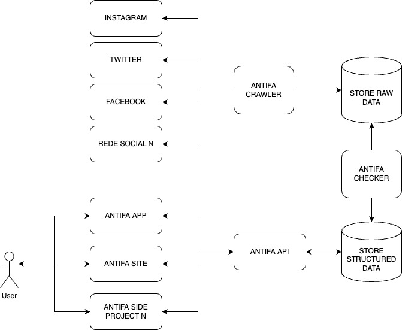

# AntiFa (Anti FakeNews)

> Estamos em fase de elaboração do [MVP](https://github.com/marcieltorres/antifakenews/issues/2)

## Visão Geral
AntiFa é um projeto dedicado a analisar e quantificar a porcentagem de notícias falsas (fake news) disseminadas por políticos e personalidades brasileiras em suas redes sociais. Nosso objetivo é promover a transparência e a responsabilidade nas mídias sociais, ajudando o público a discernir entre fatos e desinformação. A ideia desse projeto tem como base esse outro projeto aqui: https://queridodiario.ok.org.br/, onde é possível explorar diários oficiais dos municípios. Nossa ideia é que seja possível explorar todas as notícias falsas e verdadeiras que os políticos e algumas personalidades postam para que o público consiga ter ferramentas para cobrar de seus representantes.

## Problema
A disseminação de fake news por figuras públicas prejudica a integridade das informações e pode influenciar negativamente a opinião pública e as decisões políticas. Com o aumento da polarização e a rapidez com que informações falsas se espalham nas redes sociais, torna-se crucial identificar e quantificar essas ocorrências.

## Solução
Nosso projeto utiliza tecnologia de ponta em análise de dados, inteligência artificial e verificação de fatos para monitorar as postagens de políticos e personalidades nas redes sociais. Através de algoritmos de machine learning e parcerias com agências de fact-checking, podemos detectar, classificar e quantificar a desinformação presente nas postagens.

## Metodologia:

1) Coleta de Dados: Utilização de APIs e web scraping para coletar postagens de redes sociais (Twitter, Facebook, Instagram) de uma lista predefinida de políticos e personalidades.

2) Análise de Conteúdo: Aplicação de algoritmos de processamento de linguagem natural (NLP) para analisar o texto das postagens.

3) Verificação de Fatos: Colaboração com agências de fact-checking e uso de bancos de dados de fact-checks para verificar a veracidade das postagens.

4) Classificação e Quantificação: Classificação das postagens em categorias como verdadeiras, parcialmente verdadeiras, falsas ou enganosas, e cálculo da porcentagem de fake news disseminadas por cada figura pública.

5) Relatórios e Transparência: Publicação de relatórios periódicos e criação de um dashboard interativo onde o público pode visualizar as estatísticas e análises. Além disso, ter a possibilidade de vincular o teor das notícias falsas com os projetos de lei propostos por esses políticos e algumas informações extras sobre a vida pública dessas pessoas com base em projetos semelhantes a esse aqui: https://perfilpolitico.serenata.ai/

## Impacto Esperado:

1) Transparência: Aumentar a responsabilidade de políticos e personalidades na disseminação de informações.

2) Educação: Informar e educar o público sobre a prevalência de fake news e a importância da verificação de fatos.

3) Confiança: Promover uma cultura de integridade e confiança nas redes sociais e na mídia digital.

## Parceiros e Stakeholders:
- Agências de fact-checking
- Universidades e centros de pesquisa
- Plataformas de redes sociais
- ONGs e organizações de mídia
- Comunidade de desenvolvedores e especialistas em IA

## Arquitetura

## Tecnologia e recursos utilizados

- [Python 3.11](https://www.python.org/downloads/release/python-3110/) - **pré-requisito**
- [Docker](https://www.docker.com/get-started) - **pré-requisito**
- [Docker Compose](https://docs.docker.com/compose/) - **pré-requisito**
- [Poetry](https://python-poetry.org/) - **pré-requisito**
- [Ruff](https://github.com/astral-sh/ruff)

*Por favor, preste atenção nos **pré-requisitos** que você deverá instalar/configurar.*

## Como instalar, rodar e testar a aplicação

### Variáveis de ambiente

Variable | Description | Available Values | Default Value | Required
--- | --- | --- | --- | ---
ENV | O ambiente da aplicacão | `dev / test / qa / prod` | `dev` | Sim
PYTHONPATH | Guia para o python interpretar os pacotes da aplicação e dependências | [ref](https://docs.python.org/3/using/cmdline.html#envvar-PYTHONPATH) | `.` | Sim

*Nota: Quando você rodar o comando install (usando docker ou localmente), um arquivo .env será criado automaticamente baseado no arquivo [env.template](env.template)*

Command | Docker | Locally | Description
---- | ------- | ------- | -------
install | `make docker/install` | `make local/install` | Para instalar o projeto
tests | `make docker/tests` | `make local/tests` | Para rodar os testes da aplicação (com coverage)
lint | `make docker/lint` | `make local/lint` | Para rodar análises estáticas do código usando `ruff`
lint/fix | `make docker/lint/fix` | `make local/lint/fix` | Para corrigir os arquivos após a análise estática
run | `make docker/run` | `make local/run` | Para rodar a aplicação

*Confira todos os comandos disponíveis no arquivo [Makefile](Makefile)*.

## Logging

Esse projeto usa uma maneira muito simples para configurar os logs com o arquivo [logging.conf](logging.conf).

## Settings

É possível gerenciar as configurações estáticas do projeto com o arquivo [settings.conf](settings.conf) através da [classe de configuração](./src/config/settings.py) com recursos do [ConfigParser](https://docs.python.org/3/library/configparser.html).
